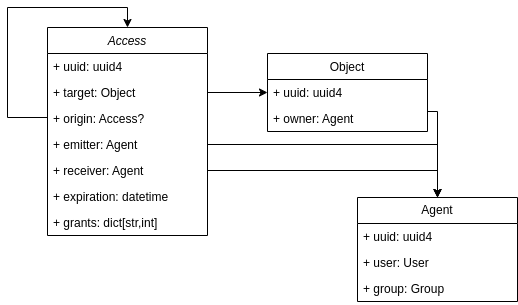

Overview
========

As explained before capabilities permission system provide access to objects only based on a :py:class:`~caps.models.reference.Reference`. This element provide: an identifier (uuid), a set of allowed actions to users (aka :py:class:`~caps.models.Capability`), and eventually an expiration date.

This figure shows how is it implemented in Django-Caps:

    The Object is accessed through its reference. A reference is assigned to an Agent which identifies the user. The reference provides capabilities which are linked to Django's auth Permission.

Django-Caps provides views that will use the provided scheme in order to grant user access or actions.

Reference
---------

As told, a Reference provides a set of capabilities. Each capability grants two things: permission (access or action) and this permission to be share (or not).

A Reference can be shared, which means that a new one will be created based one the current one. This creates a chains of parent-child references, ensuring control over the access. In Django-Caps, this process is called *derivation*, as a reference is *derived* from another one.

The first reference of this chain is the *root reference*. There only can be one reference for each object, which is owned by a single agent.

.. code-block::

    # Taking the example from index page
    from caps.models import Agent
    from .models import Post

    agent = Agent.objects.all()[0]
    agent_2 = Agent.objects.all()[2]

    # this raises ValueError: only one reference is allowed
    post = Post.objects.filter(references__isnull=False).first()
    ref = Post.Reference.create_root(agent, post)
